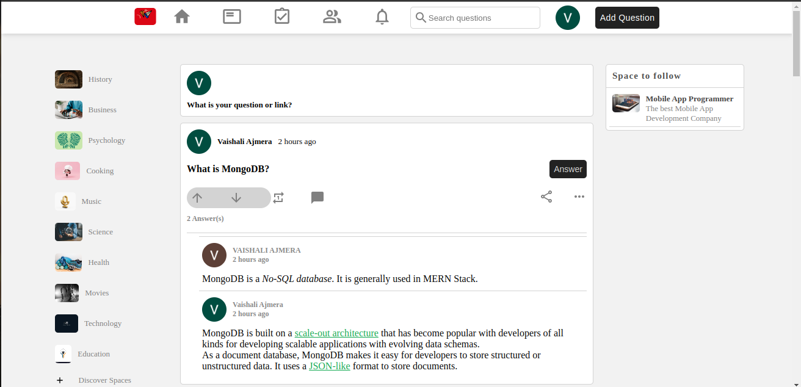

# Community Forum App (MERN Stack)

 
<!-- Replace "link-to-image.png" with the actual URL of the app's screenshot -->

This is a Community Forum web application built using the MERN stack (MongoDB, Express, React, Node.js). The app allows users to post questions, provide answers, and engage in discussions on various topics. Additionally, authentication is handled using Google Firebase.

## Features

- User Registration and Authentication using Google Firebase
- Post Questions and Answers on different topics
- Like and Dislike Answers
- View other users' profiles and contributions
- Search functionality for finding specific questions or topics
- Responsive design for seamless use on various devices

## Technologies Used

- MongoDB: For the database to store questions, answers, and user information.
- Express: To handle server-side logic and API endpoints.
- React: For building the front-end user interface and components.
- Node.js: To run the server and manage backend functionality.
- Google Firebase: For user authentication and hosting the app.
- Additional libraries: [List any additional libraries used, e.g., React Router, Axios, etc.]

## Getting Started

To run the Community Forum app locally, follow these steps:

1. Clone the repository:

```bash
git clone https://github.com/your-username/community-forum-app.git
```

2. Navigate to the project directory:

```bash
cd community-forum-app
```

3. Install the dependencies for both the server and client:

```bash
cd backend
npm install

cd frontend
npm install
```

4. Configure Firebase Authentication:

   - Create a new project on Firebase.
   - Set up Google Sign-In for your project and get the Firebase web config.
   - Replace the Firebase config in the client/src/firebase.js file.

5. Set up MongoDB:

   - Create a MongoDB database and get the connection string.
   - Replace the connection string in the server/config/db.js file.

6. Run the app:

```bash
cd backend
npm start

cd frontend
npm start
```

The app should now be running on `http://localhost:8080/`.


